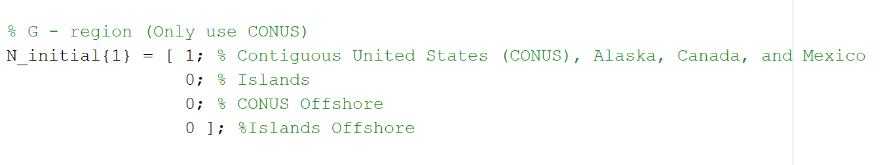
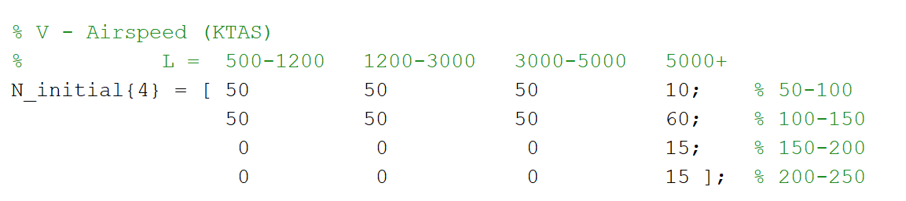
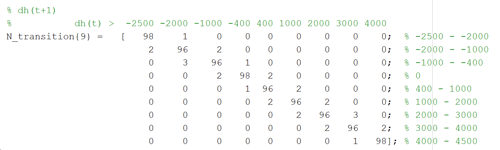
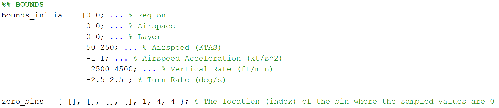
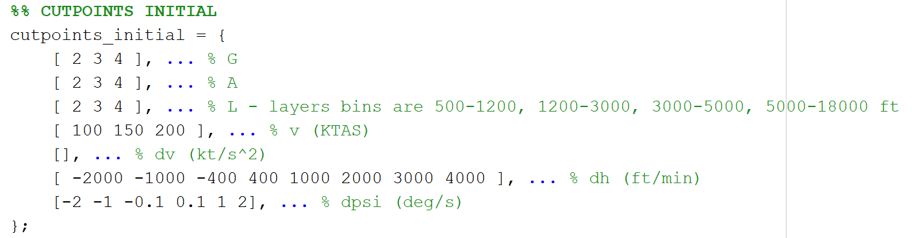
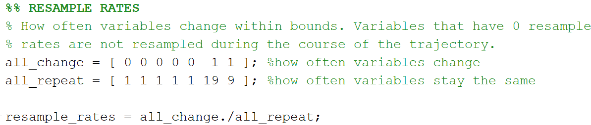

# Example_Inputs

This folder contains examples of input files that the user can use to customize the characteristics of encounter sets that they generate. There are three types of input files used by the Encounter Generation Tool: .INI parameter files, Encounter Model statistics files, and Encounter Model variables files. Each file is described below.

## .INI Parameters

The variables in the following table can be set in the .INI parameter file to customize the characteristics of generated encounter sets. Changing these parameters allows users to customize the types of encounters they wish to generate.

| Variable | Description|
|---|---|
| altLayers | Altitude layer bins used for sampling. The layers are specified in AGL feet. Each bin is specified by a lower and upper bound. Bins should be separated by commas: e.g., 500 1000, 1000 2000, indicates 2 bins: one from 500-1000 ft and one from 1000-2000 ft.   The bins for the Uncorrelated Encounter Model are 500 1200, 1200 3000, 3000 5000, 5000 18000.|
| bin_edges_VMD*  desired_proportions_VMD*   | Uncorrelated encounters are initialized to have user-specified distributions of VMD and HMD. These parameters define the VMD rejection probabilities. Values of VMD (ft) are sampled (via rejection sampling) from the bins specified by bin_edges_VMD according to the probabilities in desired_proportions_VMD. |
| bin_edges_HMD*  desired_proportions_HMD*   | Uncorrelated encounters are initialized to have user-specified distributions of VMD and HMD. These parameters define the HMD sampling distribution. Values of HMD (ft) are sampled directly from the bins specified by bin_edges_HMD according to the probabilities in desired_proportions_HMD.  |
| tCPA   | Desired time of CPA (sec)  |
| sample_time   | Desired length of the encounter (sec). This should be longer than tCPA.  |
| applyOwnshipFilterWholeEncounter  applyIntruderFilterWholeEncounter| These variables are used to perform rejection sampling based on altitude/speed limits after an encounter is initialized. These variables can be applied to both encounter model sampled trajectories and predefined trajectories. With this option, min/max altitude/speed limits are checked at every time step.    1, if altitude/speed filters should be applied over the entire encounter when generating encounters. 0, otherwise. Encounters with altitudes/speeds outside of the limits are rejected. |
| applyOwnshipFilterAtCPA  applyIntruderFilterAtCPA|These variables are used to perform rejection sampling based on altitude/speed limits after an encounter is initialized. These variables can be applied to both encounter model sampled trajectories and predefined trajectories. With this option, min/max altitude/speed limits are only checked at TCA.    1, if altitude/speed filters should be applied at CPA when generating encounters. 0, otherwise. Encounters with altitudes/speeds outside of the limits are rejected. |
| applyOwnshipFilterSampling  applyIntruderFilterSampling| These variables are only applicable if predefined trajectories (rather than encounter model samples) are used to generate encounters. These variables are used to perform rejection sampling based on altitude/speed limits during the sampling step.    1, if altitude/speed filters should be applied when sampling trajectories. 0, otherwise. |
| quantizeOwnshipAlt500  quantizeIntruderAlt500| These variables are only applicable if encounter model samples are used to generate encounters. If desired, altitudes can be quantized to 500 ft when the aircraft are level to reflect standard aircraft cruising altitudes.    1, if altitude should be quantized to 500ft, when the aircraft is level. 0, otherwise. |
| sampleByDurationOwnship  sampleByDurationIntruder| These variables are only applicable if trajectories are used to generate encounters.    1, if the process should be weighted so that longer tracks are more likely to be sampled than shorter tracks. 0, if the trajectories should be sampled uniformly. |
| encIds   | Unique IDs for the generated encounters.    **Note:** The number of encounters generated is equal to the number of unique IDs provided. |
| ownshipSampleTrajectory  intruderSampleTrajectory| 1, to sample from a set of trajectories. 0, to sample from the encounter model.  |
| ownshipEmFile   | Ownship file containing an Uncorrelated Encounter Model (`uncor_1200code_v2p1.txt`). |
| intruderEmFile   | Intruder file containing an Uncorrelated Encounter Model (`uncor_1200code_v2p1.txt`). |
| maxOwnAlt_ft  maxIntAlt_ft  minOwnAlt_ft  minIntAlt_ft   maxOwnAltType  maxIntAltType  minOwnAltType  minIntAltType| Range of ownship and intruder altitudes (in feet) used for rejection sampling. The type variables indicate whether the altitude limits are specified in AGL or MSL. **Note:** regardless of input type, the encounter model outputs altitudes as AGL.   If no altitude limits are used, the altitude variables may be set to an empty value ([]), and the types can be set to an empty string (‘’). |
| maxOwnSpeed_kts  maxIntSpeed_kts  minOwnSpeed_kts  minIntSpeed_kts| Range of ownship and intruder speeds (in knots) used for rejection sampling.    If no speed limits are used, these variables may be set to an empty value ([]). |
| ownEncVariablesFile  ownEncStatisticsFile   intEncVariablesFile  intEncStatisticsFile| Files containing modified Uncorrelated Encounter Model variables and statistics. See the Encounter Model Files section below for instructions on how to setup these files.  If the user is not modifying the Uncorrelated Encounter Model parameters, these variables may be set to an empty string (‘’). |
| saveDirectory   | Folder where generated encounters and associated metadata should be saved. |
| testDirectory   | If running unit tests, folder where results from the tests should be saved.  If the user does not wish to save test figures, this variable may be set to an empty string (‘’). |
| trajectory_trajectory_datafile  ownship_trajectory_datafile| If sampling from trajectories, name of the file containing metadata for the trajectories. See the Trajectory Files section below for data that should be including in the metadata file.  If not sampling from trajectories, these variables may be set to an empty string (‘’). |
| ownship_trajectory_dir  intruder_trajectory_dir| If sampling from trajectories, directory where the ownship or intruder trajectories are stored.    If not sampling from trajectories, these variables may be set to an empty string (‘’). |
| H_min | Minimum initial separation cylinder height (feet). With R_min, this is used to ensure sufficient separation between the two aircraft at the start of the encounter. |
| R_min | Minimum initial separation cylinder radius (nmi). With H_min, this is used to ensure sufficient separation between the two aircraft at the start of the encounter.  |
| randSeed   | Initial seed used to control the random numbers generated by the encounter generation process  |
| verbose_level | Used to control what is displayed to the console. A value of 0 will display everything, while greater integers will display less.

*Changing bin_edges_VMD, desired_proportions_VMD, bin_edges_HMD, and desired_proportions_HMD parameters is not recommended, as these values have been chosen to achieve a reasonable maximum to minimum encounter weight ratio, and produce a large number of NMACs for confidently estimating induced risk.

## Encounter Model Files
The Uncorrelated Encounter Model is flexible in that different aircraft and encounter scenarios can be modeled simply by defining encounter model parameters, such as the altitude and speed distributions for the ownship and intruder. An uncorrelated encounter is generated by independently sampling two aircraft trajectories and then pairing and orienting them into an encounter. Thus, one trajectory can simply be replaced by a sample from an alternate model. The Uncorrelated Encounter Model consists of two Bayesian networks – one used to sample the initial aircraft state (initial network) and one to sample encounter model events (transition network). The initial network variables include geographic region, airspace class, altitude layer, airspeed, airspeed acceleration, vertical rate, and turn rate. The transition network variables include all of the initial network variables, and then change in airspeed, change in vertical rate, and change in turn rate. Each variable has an associated set of bins from which values are sampled. This section explains how to tune these variables. See this [paper](https://apps.dtic.mil/sti/pdfs/ADA589697.pdf) for a full description of the Uncorrelated Encounter Model architecture and parameters.

This folder includes example statistics and variables files for modeling HALE (High Altitude Long Endurance), MALE (Medium Altitude Long Endurance), and LEPR (Low End Performance Representative) aircraft using the Uncorrelated Encounter Model. These HALE, MALE, and LEPR models have been used to support a variety of studies supporting RTCA SC-228 and the Air Force, including MITRE's C-ABSAA Study 5.

### Statistics File

The statistics file contains counts of how often each bin should be sampled for each variable. _N\_initial_ defines the statistics for the initial Bayesian network and _N\_transition_ defines the statistics for the transition Bayesian network. For independent variables, the statistics will be defined in a vector. For variables that are dependent on another variable, the statistics are defined in a matrix. For instance, Geographic Regions is an independent variable with 4 bins:

In this example, since all of the bins are 0 except for the first bin, all encounters will be sampled from the CONUS region. If all the bins had a 1, then the encounters would be sampled uniformly from the four regions.

As another example, the Airspeed variable is dependent on Altitude Layer, so the statistics for the Airspeed variable is a matrix where the columns are the different altitude layer bins and the rows are the different airspeed bins. The counts in this matrix indicate how often the airspeed bins should be sampled for each altitude layer. In the example below for a HALE aircraft, when the sampled altitude is in one of the first 3 bins (500-1200 ft, 1200-3000 ft, 3000-5000ft), then the airspeed is sampled uniformly from the first 2 airspeed bins (50-100 kts, 100-150 kts), since the counts are the same (50) for each of these bins. Airspeeds greater than 150 kts are not sampled for these altitudes, since the counts for the last 2 airspeed bins (150-200 kts, 200-250 kts) are 0.

On the other hand, for the last altitude layer (5000+ ft), the airspeed is sampled from all 4 bins, but airspeeds between 100-150 kts are sampled most frequently since the count for this bin (60) is higher than the other bins. The 100-150 kts bin is sampled 60/(10+60+15+15) = 60% of the time when the altitude is above 5000 ft.

The statistics for the transition matrix are defined in the same matrix, except the columns are bins for the current airspeed/vertical rate/turn rate, and the rows are bins for the airspeed/vertical rate/turn rate, respectively, at the next time step. The counts in the matrices are then how often the encounter’s airspeed/vertical rate/turn rate stays in the same bin versus transitioning to a different bin. Typically, the airspeed/vertical rate/turn rate will stay in the same bin with a slight probability of transitioning to an adjacent bin as shown in the example for vertical rate (fpm) below:

See `hale_uncor_statistics.m`, `male_uncor_statistics.m`, and `lepr_uncor_statistics.m` for example statistics files.

### Variables File
The variables file defines the structure of the Bayesian networks in the Uncorrelated Encounter Model. Most users will not need to change the actual structure of the model. Instead, most users will probably only want to change the cutpoints, bounds, and resample rates sections of this file, which are described below.

Bounds are the maximum and minimum values for each of the variables, and cutpoints are the edges of the bins used to sample each variable. Bounds are combined with cutpoints to create the bins used to sample each variable. For instance, with using the cutpoints and bounds shown below, airspeed would be sampled from 4 different bins: 50-100 kts, 100-150 kts, 150-200 ks, 200-250 kts. Bins are sampled uniformly. For categorical variables, such as region, airspace, and layer, the bounds are set to [0,0].

When defining bounds, the user also has the option of setting _zero\_bins_, which denote the index of the bin where the sampled values should be set to 0 for each variable, rather than sampling within the bin. For instance, in this example, vertical rate and turn rate are set to 0 when the fourth bin is sampled. The zero-bin should be 1 for variables that are always set to 0, like acceleration in this example. Variables that are always set to 0 should have empty cutpoints.

Finally, the user may also wish to tune the resample rates. Resample rates control how often the value of each encounter model variable is resampled within the same bin: _all\_change_ indicates how often the variables change and _all\_repeat_ indicates how often the variables stay the same. Tune _all\_change_ and _all\_repeat_ to achieve the desired variability of each variable; the order of the variables in _all\_change_ and _all\_repeat_ is the same as the order for borders and cutpoints. Variables that stay the same throughout the encounter should have an _all\_change_ value of 0. In this example, geographic region, airspace class, altitude layer, velocity, and acceleration stay the same throughout the entire encounter, so they have a resample rate of 0.

See `uncor_variables.m` and `uncor_variables_lepr.m` for example variables files.

## Trajectory Files
Users have the option to generate encounters from a set of encounter trajectories. Trajectories can be provided for the ownship, intruder, or both. Different sets of trajectories can be used for the ownship and intruder. Each trajectory must be provided in a .csv, which must contain the following data:

| Column | 1	| 2 |	3 |	4 |	5 |	6 |	7 |	8	| 9 |
| --- | --- | --- |--- |--- |--- |--- |--- |--- |--- |
| **Variable** | ID | Time | lat | lon | Altitude (AGL) | Speed| Heading | Vertical Speed | Altitude (MSL)|
| **Units**  | N/A | sec | deg | deg | ft | kts | deg | fpm | ft |

**Note:** In order to work with the encounter generation tool, the trajectories must be provided at 1 hz. A set of 100 trajectories sampled from the Uncorrelated Encounter Model are included with this distribution and can be found in the Example_Trajectory_Encounters directory.

Each set of trajectories must also have a metadata file that contains the following information for each encounter. Note that the column names must be the same as in the table in order for the Encounter Generation Tool to be able to properly process the data:

| Variable | Description	| Units |
| --- | --- | --- |
| filename | Corresponding trajectory .csv file | N/A |
| Track_length  | Duration of trajectory | sec |
| Min_Alt_msl  | Minimum altitude during trajectory (MSL)  | ft |
| Max_Alt_msl | Maximum altitude during trajectory (MSL)  | ft |
| Min_Speed  | Minimum speed during trajectory  | kts |
| Max_Speed  | Maximum speed during trajectory  | kts |
| Min_Alt_agl  | Minimum altitude during trajectory (AGL)  | ft |
| Max_Alt_agl  | Maximum altitude during trajectory (AGL) | ft |
| trackId  | Track ID  | N/A |

An example metadata file corresponding to the 100 example trajectories can be found in the Example_Trajectory_Encounters directory. The location(s) where the trajectories and metadata file are located must be specified in the .INI file.

## Distribution Statement

DISTRIBUTION STATEMENT A. Approved for public release. Distribution is unlimited.

© 2018, 2019, 2020 Massachusetts Institute of Technology.

This material is based upon work supported by the National Aeronautics and Space Administration under Air Force Contract No. FA8702-15-D-0001. Any opinions, findings, conclusions or recommendations expressed in this material are those of the author(s) and do not necessarily reflect the views of the National Aeronautics and Space Administration .

Delivered to the U.S. Government with Unlimited Rights, as defined in DFARS Part 252.227-7013 or 7014 (Feb 2014). Notwithstanding any copyright notice, U.S. Government rights in this work are defined by DFARS 252.227-7013 or DFARS 252.227-7014 as detailed above. Use of this work other than as specifically authorized by the U.S. Government may violate any copyrights that exist in this work.
