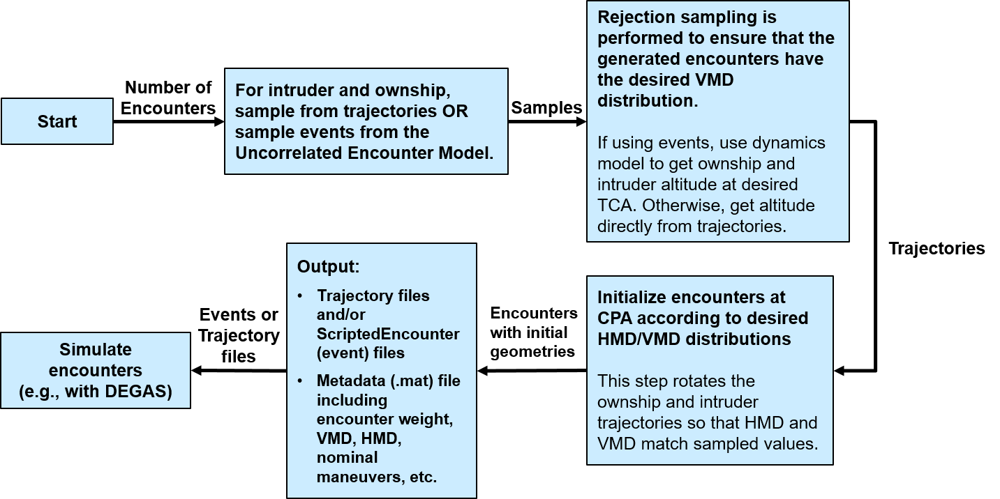

# Encounter Generation Tool

This repository is the public release of the DAA Encounter Generation Tool. This tool is a collection of MATLAB code to generate pairwise, uncorrelated encounters that can be run in a simulation environment, such as MIT Lincoln Laboratory’s DEGAS (DAA Evaluation of Guidance, Alerting, and Surveillance).

- [Encounter Generation Tool](#encounter-generation-tool)
  - [Nomenclature](#nomenclature)
  - [Encounter Models](#encounter-models)
  - [Tool Overview](#tool-overview)
  - [Directory Structure](#directory-structure)
    - [doc](#doc)
    - [Encounter_Generation_Tool](#encounter_generation_tool)
    - [Example_Inputs](#example_inputs)
    - [Example_Outputs](#example_outputs)
    - [Example_Trajectory_Encounters](#example_trajectory_encounters)
    - [Inputs](#inputs)
    - [Outputs](#outputs)
    - [Tests](#tests)
  - [Initial Setup](#initial-setup)
    - [Persistent System Environment Variables](#persistent-system-environment-variables)
    - [em-core](#em-core)
    - [em-model-manned-bayes](#em-model-manned-bayes)
    - [Mex](#mex)
    - [Testing the tool](#testing-the-tool)
  - [Run Order](#run-order)
    - [Configure input file](#configure-input-file)
    - [Generate Encounters](#generate-encounters)
  - [Units](#units)
    - [Units for Inputs to the Encounter Generation Tool](#units-for-inputs-to-the-encounter-generation-tool)
    - [Units for Outputs of the Encounter Generation Tool](#units-for-outputs-of-the-encounter-generation-tool)
  - [Known Issues/Limitations](#known-issueslimitations)
  - [Citation](#citation)
  - [Distribution Statement](#distribution-statement)

## Nomenclature

Acronym | Phrase
 :--- | :---
CPA | Closest Point of Approach
DAA | Detect and Avoid
DEGAS | DAA Evaluation of Guidance, Alerting, and Surveillance
HMD | Horizontal Miss Distance
NMAC | Near Mid-Air Collision (500 ft horizontally, 100 ft vertically)
TCA | Time of Closest Approach (at minimum horizontal separation)
VMD | Vertical Miss Distance

## Encounter Models

For many aviation Detect and Avoid (DAA) safety studies, aircraft behavior and relative geometry is represented using encounter models, which are statistical models of how aircraft behave during close encounters. They are used to provide a realistic representation of the range of encounter flight dynamics where an aircraft DAA system would be likely to alert. Encounter models represent the encounter geometry, but also the aircraft behavior (accelerations) during the course of the encounter. Encounter models have been developed for many different manned operational contexts, but there are new considerations for unmanned aircraft operations including the lower operating altitudes and interactions with service providers and other users. For a complete overview of MIT Lincoln Laboratory’s encounter models and access to these models, please see https://github.com/Airspace-Encounter-Models/em-overview.

## Tool Overview

The Encounter Generation Tool performs all of the steps necessary to generate a set of pairwise, uncorrelated encounters that can be run in a simulation environment, such as MIT Lincoln Laboratory’s DEGAS (DAA Evaluation of Guidance, Alerting, and Surveillance). DEGAS is a simulation framework created by MIT LL to perform simulations of Detect and Avoid (DAA) Systems. Uncorrelated encounters are those that do not include air traffic control intervention: e.g., between a cooperative (transponder equipped) and noncooperative aircraft, or two noncooperative aircraft. The process for generating encounters is shown below.

*Encounter Generation Process*

The first step of generating encounters is to sample trajectories for the ownship and intruder. The trajectories can be sampled from an encounter model or they can be sampled from a set of pre-generated trajectories (e.g., tracks observed in flight test data). The encounter model defines trajectories in terms of events, which specify the times at which a change in dynamics (e.g., turn rate, vertical rate, or acceleration) occurs. The ownship and intruder trajectories may be sampled from different sources. This step of the process is performed by [`dbn_hierarchical_sample.m`](./Encounter_Generation_Tool/dbn_hierarchical_sample.m) for encounter model samples and [`sampleTrajectory.m`](./Encounter_Generation_Tool/sampleTrajectory.m) for trajectory samples.

The next step is to determine where to position the two trajectories with respect to one another based on sampled values of VMD and HMD. The encounter generation tool uses a statistical technique known as importance sampling to oversample encounters of interest (e.g., NMACs). To do this, encounters are sampled using “proposed” distributions of VMD and HMD, chosen by the user. In a typical use case, these distributions are concentrated on VMDs of less 100 ft and HMDs of less than 500 ft in order to increase the number of NMACs that are generated. A large number of NMACs is needed in order to be able to estimate the risk ratio of a Detect-and-Avoid (DAA) system with statistical significance. However, this many NMACs do not naturally occur in the airspace. Hence, to compute metrics, the encounters must be reweighted to match the “actual” or nominal distributions of VMD and HMD observed in the real world. More information about importance sampling can be found [here](https://statweb.stanford.edu/~owen/mc/Ch-var-is.pdf).

The first part of the importance sampling process is sampling VMD for the encounter. Rejection sampling is performed until a pair of trajectories with the desired VMD are sampled. Rejection sampling is performed for VMD (whereas HMD is sampled directly), because the nominal VMD distribution is not known a priori, as it is defined by the altitude distributions of both aircraft.

Once the trajectories are sampled, they must be oriented relative to each other to form an encounter. This step of the process is performed by [`initializeUncorrelatedEncounter.m`](./Encounter_Generation_Tool/initializeUncorrelatedEncounter.m). During this step, HMD is sampled and the trajectories are rotated so that the encounter’s HMD and VMD match the sampled values. An encounter weight is also computed to reweight the distributions of VMDs and HMDs back to their nominal distributions: the encounter weight is part of the importance sampling process and should be used when computing all summary metrics.

Once the relative geometries of the trajectories have been determined, the generation process is complete. At this stage, any additional desired rejection sampling (e.g., to limit the minimum/maximum altitude/speed of the ownship/intruder) is performed. If the encounter is satisfactory, the encounter is saved out in a user-specified format (either encounter model events or trajectory waypoint files), and associated metadata for the encounter (e.g., HMD, VMD) are saved in a Matlab data (.mat) file.

If the encounters are being generated for use with [DEGAS](https://github.com/mit-ll/degas-core), DEGAS currently supports both encounter model events or trajectories as inputs.

## Directory Structure

The Encounter Generation Tools top-level directory contains the following directories:

### doc

This folder contains images used by Markdown files.

### Encounter_Generation_Tool

This folder contains the code that makes up the Encounter Generation Tool, and includes all files needed to perform the steps described in the Overview. Note that this tool also uses common encounter model code that is part of  MIT Lincoln Laboratory’s public [Airspace Encounter Models GitHub repository](https://github.com/Airspace-Encounter-Models). Instructions for accessing these repositories are provided in the following [section](#initial-setup).

### Example_Inputs

Input parameter files (.INI) are used to specify the desired characteristics of the generated encounter set (e.g., number of encounters). The user has the option to generate encounters using either trajectories sampled from an encounter model or a set of pre-defined trajectories. Encounter model trajectories are formed by sampling from distributions of aircraft characteristics, including airspeed, altitude, and vertical rate. These distributions can be modified using encounter model statistics and variables files. All of the available input options are described in detail in the Inputs folder.

### Example_Outputs

The Encounter Generation Tool outputs encounters and their corresponding metadata. The metadata will be output in a .mat file. The user can choose to output the encounter trajectories either as encounter model events in a .mat file, or as waypoints in a .txt file. Encounters defined using events are known as scripted encounters. Note that the initial release of DEGAS is only set up to accept encounters as encounter model events. For the final release, DEGAS will be able to accept trajectories as well. The format and contents of the outputs are described in the Outputs folder.

### Example_Trajectory_Encounters

This folder contains a set of 100 trajectories sampled from the Uncorrelated Encounter Model and their associated metadata. These are used for verification testing.

### Inputs

Default folder for storing user generated input parameter files.

### Outputs

Default folder for storing user generated encounters and their corresponding metadata.

### Tests

The Encounter Generation Tool includes a suite of tests that can be used to verify that the tool functions as expected. These tests can be found in the `Tests/Code` folder.

## Initial Setup

### Persistent System Environment Variables

Immediately after cloning this repository, [create a persistent system environment](https://superuser.com/q/284342/44051) variable titled `AEM_DIR_DAAENC` with a value of the full path to this repository root directory.

### em-core

Clone [`em-core`](https://github.com/Airspace-Encounter-Models/em-core). Confirm that the system environment variable `AEM_DIR_CORE` has been set, as instructed by its [README](https://github.com/Airspace-Encounter-Models/em-core/blob/master/README.md#persistent-system-environment-variable).

### em-model-manned-bayes

Clone [`em-model-manned-bayes`](https://github.com/Airspace-Encounter-Models/em-model-manned-bayes). Confirm that the system environment variable `AEM_DIR_BAYES` has been set, as instructed by its [README](https://github.com/Airspace-Encounter-Models/em-model-manned-bayes/blob/master/README.md#persistent-system-environment-variable).

### Mex

This repository includes code written in C that needs to be compiled using [`mex`](https://www.mathworks.com/help/matlab/ref/mex.html) before the Encounter Generation Tool can be run. This table lists all the files that need to be mexed.

| Filename  |  Folder |
| :-------------| :--  |
| run_dynamics_fast.c  | Encounter_Generation_Tool  |
| run_dynamics_fast_test.c   | Tests/Code/Helper_Functions  |

For each file, change into the directory containing the file and execute `mex -g filename.c` in the command line. According to [MATLAB documentation](https://www.mathworks.com/help/matlab/ref/mex.html), `-g,` "Adds symbolic information and disables optimizing built object code." While this is flag is primarily used for debugging, there is a known bug, likely in the .c source, where the compiled mex functions will cause segmentation faults on Mac and Linux environments when compiled without the flag. This will generate a [MEX function](https://www.mathworks.com/help/matlab/call-mex-file-functions.html)--e.g., `filename.mexw64` for windows or `filename.mexa64` for linux. For example:

``` matlab
mex -g Encounter_Generation_Tool/run_dynamics_fast.c
mex -g Tests/Code/Helper_Functions/run_dynamics_fast_test.c
```

### Testing the tool

1. Startup MATLAB and change the current directory to the main `/DAA_Encounter_Tool/` directory.
2. Run [`startup_impsampling`](startup_impsampling.m) to set the MATLAB path and configuration. This script needs to be run at the beginning of every MATLAB session where the Encounter Generation Tool will be used.
3. Mex the files described in the previous section. This step only needs to be performed once.
4. Run [`RUN_DAAEncounterModelTool_serial`](RUN_DAAEncounterModelTool_serial.m) in the root directory of this repository.
5. If there are no errors, then the Encounter Generation Tool has been set up correctly.

**Note:** Matlab's Symbolic Math Toolbox is required in order to run the Encounter Generation Tool.

## Run Order

Code developed and tested in Windows and Unix for Matlab R2018b. Although not tested, we expect this software to be supported by newer versions of Matlab.

### Configure input file

Prior to running the Encounter Generation Model Tool, it is necessary to setup an input file (.INI), which specifies the desired encounter set characteristics (e.g., encounter IDs, encounter duration, time of CPA, etc.). These input files are also used to specify any desired limits on aircraft speed and altitude. Example input files are provided in the Inputs directory.

### Generate Encounters

After specifying the parameters in the .INI file, encounters can be generated by calling `generateDAAEncounterSet(‘parameterFileName.ini’)`, as demonstrated in [`RUN_DAAEncounterModelTool_serial`](RUN_DAAEncounterModelTool_serial.m). The tool will save the generated encounters and associated metadata in an encounter folder specified by the user in the .INI file.

## Units

This repository is U.S. aviation units, as recommended by the [Airspace Encounter Models organization contributing guidelines](https://github.com/Airspace-Encounter-Models/em-overview/blob/master/CONTRIBUTING.md#units)

### Units for Inputs to the Encounter Generation Tool

Inputs includes user-defined trajectories and samples from the encounter models. The units for inputs are those commonly used by the United States aviation community.

| Dimension  | Unit |
| ------------- | ------------- |
| Time  | Seconds (s)  |
| Length – altitude & elevation   | Feet (ft)  |
| Length – longitudinal and lateral distance  | Feet (ft) or nautical miles (nm)  |
| Speed – vertical rate | Feet per minute (fpm)  |
| Speed – airspeed or ground speed   | Knots (kts)  |
| Aircraft angle – course, heading, roll, pitch, yaw  | Degrees (deg)  |
| Latitude & longitude coordinates   | Decimal degrees (DD)  |
| World geodetic system | WGS 84 (EPSG:4326)  |

### Units for Outputs of the Encounter Generation Tool

The units of inputs to the Encounter Generation Tool are converted to the units used for the inputs to DEGAS during the encounter generation process.

| Dimension  | Unit |
| ------------- | ------------- |
| Time  | Seconds (s)  |
| Length – altitude & elevation   | Feet (ft). All altitude outputs are AGL.  |
| Length – longitudinal and lateral distance  | Feet (ft) or nautical miles (nm)  |
| Speed – vertical rate | Feet per second (ftps)  |
| Speed – airspeed or ground speed   | Feet per second (ftps)  |
| Aircraft angle – course, heading, roll, pitch, yaw  | Radians (rad)  |
| Latitude & longitude coordinates   | Decimal degrees (DD)  |
| World geodetic system | WGS 84 (EPSG:4326)  |

Variable names will include units whenever possible for clarity.

## Known Issues/Limitations

The current known limitations of the Encounter Generation Tool are listed below:

- There may be some loss in fidelity when trajectories are converted from waypoints to encounter model events. For this reason, users are discouraged from saving generated encounters as events when pre-defined trajectories are used. Note that the final release of DEGAS will accept both trajectories and encounter model events as inputs.
- Samples from the Uncorrelated Encounter Model may result in trajectories with speeds that approach 0 (due to decelerations). Such trajectories results in unexpected behavior when simulated through the DEGAS dynamics model. Thus, it is recommended that encounters with these trajectories be discarded. The likelihood of generating encounters with these types of trajectories can be reduced by setting `minOwnSpeed_kts` and `minIntSpeed_kts` in the .INI parameter file to be some number greater that 0.

## Citation

Please use the appropriate documents listed in [`em-overview/README`](https://github.com/Airspace-Encounter-Models/em-overview/blob/master/README.md#documentation) when citing the technical concepts.

## Distribution Statement

DISTRIBUTION STATEMENT A. Approved for public release. Distribution is unlimited.

© 2018, 2019, 2020, 2021 Massachusetts Institute of Technology.

This material is based upon work supported by the National Aeronautics and Space Administration under Air Force Contract No. FA8702-15-D-0001. Any opinions, findings, conclusions or recommendations expressed in this material are those of the author(s) and do not necessarily reflect the views of the National Aeronautics and Space Administration.

Delivered to the U.S. Government with Unlimited Rights, as defined in DFARS Part 252.227-7013 or 7014 (Feb 2014). Notwithstanding any copyright notice, U.S. Government rights in this work are defined by DFARS 252.227-7013 or DFARS 252.227-7014 as detailed above. Use of this work other than as specifically authorized by the U.S. Government may violate any copyrights that exist in this work.
